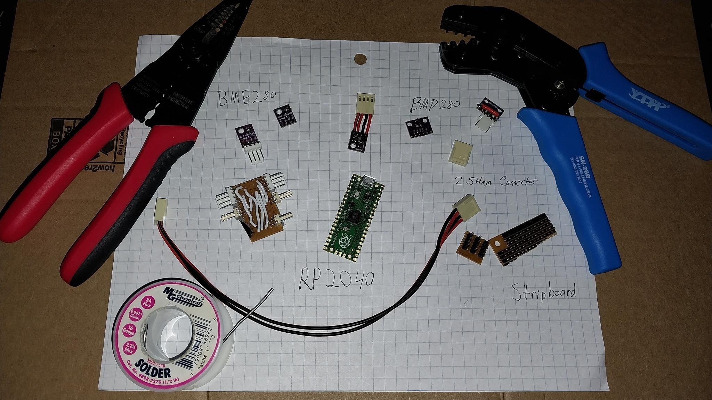
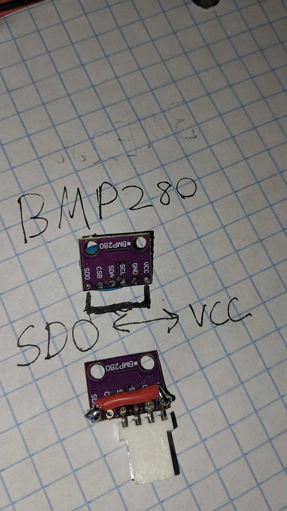

# BMx280

A Micropython library for BME280 and BMP280 sensors.

## Usage

`SensorController` can be used to connect to multiple sensors.

An instance can be created using a dict of bus numbers and pins:

```
i2c_controllers = {0: {'pins': (0, 1)},
                   1: {'pins': (26, 27)}}

controller = SensorController(i2c_controllers, ignore_missing=True)
```

> `ignore_missing` will ignore empty busses and missing devices

> `interval` defines the amount of time a request should take, acting as a mininum request time.

Once created, all attached sensor's stats can be printed with:

```
print(controller)

{"BME280-0:118;1,0": {"pressure": 101363.4, "temperature": 22.28417, "humidity": 36.84885}, "BME280-1:118;27,26": {"pressure": 101429.8, "temperature": 22.10638, "humidity": 37.86998}, "BMP280-1:119;27,26": {"pressure": 101445.0, "temperature": 22.25535}}
```

Each sensor will have a key in the format:

`<SENSOR_NAME>-<CONTROLLER>:<ADDRESS>;<SCL>,<SCA>`

## Hardware



### Parts

* [RPI Pico](https://www.raspberrypi.com/products/rp2040/)
* [BME280](https://www.bosch-sensortec.com/products/environmental-sensors/humidity-sensors-bme280/)
* [BMP280](https://www.bosch-sensortec.com/products/environmental-sensors/pressure-sensors/bmp280/)
* [Crimping tool](https://www.taydaelectronics.com/sn-48b-crimping-tool-plier-0-5-1-5-mm-for-awg-26-16.html)
* [Stripboard](https://www.taydaelectronics.com/small-stripboard-93x55mm-copper.html)
* [2.54mm Crimp Terminal](https://www.taydaelectronics.com/crimp-terminal-connector-xh-2-54mm.html)
* [4 pin 2.54mm Housing](https://www.taydaelectronics.com/connectors-sockets/wafer-housing-crimp-terminal/housing-connector-2-54mm-4-pins.html)
* [2 pin 2.54mm Housing](https://www.taydaelectronics.com/connectors-sockets/wafer-housing-crimp-terminal/housing-connector-2-54mm-2-pins.html)
* [4 pin board connector](https://www.taydaelectronics.com/connectors-sockets/wafer-housing-crimp-terminal/wafer-connector-2-54mm-4-pins-right-angle.html)
* [2 pin board connector](https://www.taydaelectronics.com/connectors-sockets/wafer-housing-crimp-terminal/wafer-connector-2-54mm-2-pins-right-angle.html)

### Breakout board


Making a breakout board to attach sensors can help keep wiring neater, and reduce the amount of soldering directly onto the microcontroller.

> A simple bus extender can be made by attaching board connectors to the same row on stripboard. Keyed connectors can be beneficial to ensure devices aren't connected backwards.

### Address change

Every device on an I2C bus must has a unique address to be accessed, all of these sensors have the same address, but this can be increaased by 1 with some soldering.

#### BMP280

On a BMP280, connecting SDO to VCC will change the address:



### Tips

#### Stripboard

When using stripboard, it can be scored over the holes and snapped to shape.

#### Insulation

Tape can be added to the back of a board to protect traces from shorting.
